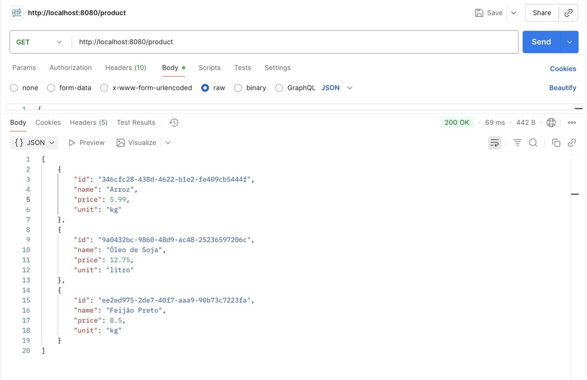

# Product API - Documentação

## Visão Geral

A **Product API** é uma API RESTful de CRUD (Create, Read, Update, Delete) desenvolvida em Spring Boot para gerenciamento de produtos. O projeto segue uma arquitetura de microserviços, onde o **Product** atua como um FeignClient que comunica com o **Product Service**, responsável pela lógica de negócios e persistência de dados em PostgreSQL. A API permite criar, listar, buscar e deletar produtos através de endpoints HTTP, utilizando DTOs (ProductIn/ProductOut) para contratos de API e suportando recursos como caching com Redis e migrações de banco de dados com Flyway.

---

## Endpoints Principais

### 1. Criar Produto
**Endpoint:** `POST /product`

**Descrição:** Cria um novo produto no sistema.

**Request Body:**
```json
{
  "name": "Arroz Integral",
  "price": 12.50,
  "unit": "kg"
}
```

**Response (201 Created):**
```json
{
  "id": "550e8400-e29b-41d4-a716-446655440000",
  "name": "Arroz Integral",
  "price": 12.50,
  "unit": "kg"
}
```

---

### 2. Listar Todos os Produtos
**Endpoint:** `GET /product`

**Descrição:** Retorna a lista de todos os produtos cadastrados.

**Response (200 OK):**
```json
[
  {
    "id": "550e8400-e29b-41d4-a716-446655440000",
    "name": "Arroz Integral",
    "price": 12.50,
    "unit": "kg"
  },
  {
    "id": "660e8400-e29b-41d4-a716-446655440001",
    "name": "Feijão Preto",
    "price": 8.90,
    "unit": "kg"
  }
]
```

---

### 3. Buscar Produto por ID
**Endpoint:** `GET /product/{id}`

**Descrição:** Retorna os detalhes de um produto específico.

**Exemplo:** `GET /product/550e8400-e29b-41d4-a716-446655440000`

**Response (200 OK):**
```json
{
  "id": "550e8400-e29b-41d4-a716-446655440000",
  "name": "Arroz Integral",
  "price": 12.50,
  "unit": "kg"
}
```

---

### 4. Deletar Produto
**Endpoint:** `DELETE /product/{id}`

**Descrição:** Remove um produto do sistema.

**Exemplo:** `DELETE /product/550e8400-e29b-41d4-a716-446655440000`

**Response (204 No Content)**

---

## Testes com Postman

### Criar Produto


### Listar Produtos


### Buscar Produto por ID


### Deletar Produto


---

## Estrutura do Projeto

### Product API (FeignClient)
```
📁 api/
└── 📁 product/
    ├── 📁 src/
    │   └── 📁 main/
    │       └── 📁 java/
    │           └── 📁 store/
    │               └── 📁 product/
    │                   ├── 📄 ProductController.java
    │                   ├── 📄 ProductIn.java
    │                   └── 📄 ProductOut.java
    ├── 📄 pom.xml
    └── 📄 README.md
```

### Product Service API
```
📁 api/
└── 📁 product_service/
    ├── 📁 src/
    │   ├── 📁 main/
    │   │   ├── 📁 java/
    │   │   │   └── 📁 store/
    │   │   │       └── 📁 product/
    │   │   │           ├── 📄 ProductApplication.java
    │   │   │           ├── 📄 ProductResource.java
    │   │   │           ├── 📄 ProductService.java
    │   │   │           ├── 📄 Product.java
    │   │   │           ├── 📄 ProductModel.java
    │   │   │           ├── 📄 ProductRepository.java
    │   │   │           └── 📄 ProductParser.java
    │   │   └── 📁 resources/
    │   │       ├── 📄 application.yaml
    │   │       └── 📁 db/
    │   │           └── 📁 migration/
    │   │               ├── 📄 V2025.10.27.001__create_schema.sql
    │   │               └── 📄 V2025.10.27.002__create_table_product.sql
    │   ├── 📁 test/
    │   │   ├── 📁 java/
    │   │   │   └── 📁 store/
    │   │   │       └── 📁 product/
    │   │   │           └── 📄 ProductResourceTest.java
    │   │   └── 📁 resources/
    │   │       ├── 📄 application-test.yaml
    │   │       └── 📁 db/
    │   │           └── 📁 migration/
    │   └── 📁 k8s/
    │       └── 📄 k8s.yaml
    └── 📄 pom.xml
```

---

## Repositórios

| Componente | Descrição | Link do Repositório |
|------------|-----------|---------------------|
| **Product API** | FeignClient para comunicação entre microserviços | [https://github.com/DeenaElOrra/product] |
| **Product Service** | Serviço principal com lógica de negócios e persistência | [https://github.com/DeenaElOrra/product_service] |
| **Gateway** | API Gateway para roteamento de requisições | [https://github.com/DeenaElOrra/gateway-service] |

---

## Configuração e Execução

### Pré-requisitos
- Java 21+
- Maven 3.8+
- PostgreSQL 14+
- Redis (opcional, para caching)

### Variáveis de Ambiente (Product Service)
```bash
DATABASE_HOST=localhost
DATABASE_PORT=5432
DATABASE_USER=store
DATABASE_PASSWORD=store
```

### Executar Product Service
```bash
cd api/product_service
mvn clean install
mvn spring-boot:run
```

A aplicação estará disponível em: `http://localhost:8080`

---

## Schema do Banco de Dados

```sql
CREATE SCHEMA IF NOT EXISTS product;

CREATE TABLE product.product (
    id varchar(36) NOT NULL,
    name varchar(255) NOT NULL,
    price decimal(10,2) NOT NULL,
    unit varchar(20) NOT NULL,
    CONSTRAINT product_primary_key PRIMARY KEY (id)
);
```

---

## Testes

### Executar Testes de Integração
```bash
cd api/product_service
mvn test
```

Os testes utilizam TestContainers para subir uma instância PostgreSQL em container Docker.

---
