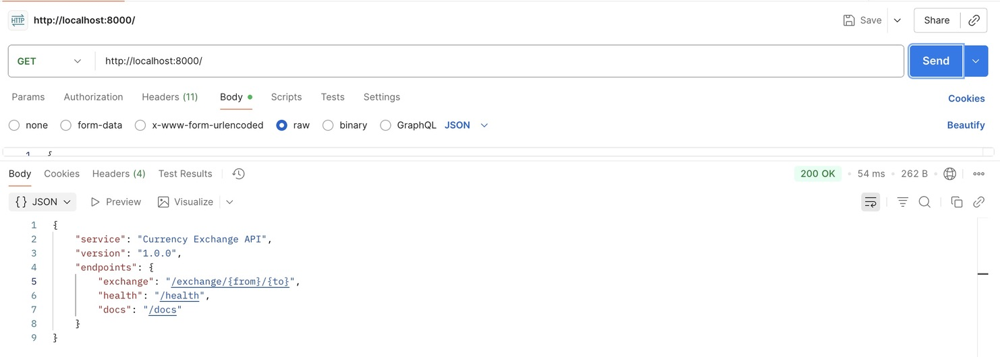
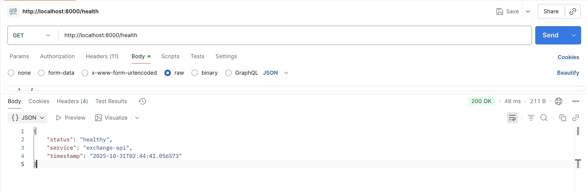

# Exchange API - Documentação

## Visão Geral

A **Exchange API** é uma API RESTful desenvolvida em Python com FastAPI para gerenciamento de taxas de câmbio em tempo real. A API integra-se com o serviço externo [Awesome API](https://economia.awesomeapi.com.br) para obter cotações atualizadas de moedas e aplica um spread de 1.5% para cálculo das taxas de compra e venda. O serviço é protegido por autenticação JWT através do API Gateway e requer um ID de conta válido em cada requisição. A API suporta operações assíncronas para melhor performance e é totalmente containerizada com Docker e Kubernetes.

---

## Endpoints Principais

### 1. Obter Taxa de Câmbio
**Endpoint:** `GET /exchange/{from_currency}/{to_currency}`

**Descrição:** Retorna as taxas de compra e venda entre duas moedas.

**Headers Obrigatórios:**
```
Authorization: Bearer {jwt_token}
id-account: {account_id}
```

**Parâmetros de Path:**
- `from_currency`: Código da moeda de origem (3 letras, ex: USD, BRL, EUR)
- `to_currency`: Código da moeda de destino (3 letras, ex: USD, BRL, EUR)

**Exemplo:** `GET /exchange/USD/BRL`

**Response (200 OK):**
```json
{
  "buy": 5.2575,
  "sell": 5.1825,
  "timestamp": "2025-10-31 14:30:45",
  "account_id": "550e8400-e29b-41d4-a716-446655440000",
  "base_rate": 5.22
}
```

**Campos da Resposta:**
- `buy`: Taxa de compra com spread de 1.5% aplicado
- `sell`: Taxa de venda com spread de 1.5% aplicado
- `timestamp`: Data e hora da transação
- `account_id`: ID da conta do usuário autenticado
- `base_rate`: Taxa base sem spread (obtida da API externa)

**Códigos de Status:**
- `200 OK`: Taxa de câmbio retornada com sucesso
- `400 Bad Request`: Códigos de moeda inválidos ou par não suportado
- `401 Unauthorized`: Account ID ausente ou inválido
- `503 Service Unavailable`: API externa indisponível
- `504 Gateway Timeout`: Timeout ao chamar API externa
- `500 Internal Server Error`: Erro interno do servidor

---

### 2. Health Check
**Endpoint:** `GET /health`

**Descrição:** Verifica o status de saúde do serviço.

**Autenticação:** Não requerida

**Response (200 OK):**
```json
{
  "status": "healthy",
  "service": "exchange-api",
  "timestamp": "2025-10-31T14:30:45.123456"
}
```

---

### 3. Informações da API
**Endpoint:** `GET /`

**Descrição:** Retorna informações sobre a API e seus endpoints disponíveis.

**Autenticação:** Não requerida

**Response (200 OK):**
```json
{
  "service": "Currency Exchange API",
  "version": "1.0.0",
  "endpoints": {
    "exchange": "/exchange/{from}/{to}",
    "health": "/health",
    "docs": "/docs"
  }
}
```

---

## Testes com Postman

### Obter Taxa de Câmbio (USD para BRL)


### Informações da API


### Health Check


---

## Estrutura do Projeto

### Exchange API (FastAPI)
```
📁 api/
└── 📁 exchange/
    ├── 📁 app/
    │   ├── 📄 main.py
    │   └── 📄 requirements.txt
    ├── 📁 k8s/
    │   └── 📄 k8s.yaml
    ├── 📄 Dockerfile
    ├── 📄 README.md
    └── 📁 .git/
```

---

## Repositórios

| Componente | Descrição | Link do Repositório |
|------------|-----------|---------------------|
| **Exchange API** | API de taxas de câmbio em tempo real (FastAPI) | https://github.com/DeenaElOrra/exchange |
| **Gateway Service** | API Gateway para roteamento e autenticação | https://github.com/DeenaElOrra/gateway-service |

---

## Configuração e Execução

### Executar Localmente (sem Docker)

```bash
cd api/exchange
pip install -r app/requirements.txt
uvicorn app.main:app --reload --host 0.0.0.0 --port 8000
```

A aplicação estará disponível em: `http://localhost:8000`

### Executar com Docker

```bash
cd api/exchange
docker build -t exchange-api .
docker run -p 8000:8000 exchange-api
```

### Deploy no Kubernetes

```bash
cd api/exchange
kubectl apply -f k8s/k8s.yaml
```

O serviço estará disponível internamente no cluster em: `http://exchange:80`

---

## Arquitetura de Microserviços

### Comunicação com Gateway

```
Cliente
  |
  v
[Gateway Service - Spring Cloud Gateway] :8080
  |
  ├── Valida JWT token
  ├── Extrai Account ID do Auth Service
  ├── Adiciona header: id-account
  |
  v
[Exchange Service - FastAPI] :80
  |
  ├── Valida Account ID
  ├── Valida códigos de moeda
  ├── Chama API Externa (Awesome API)
  ├── Aplica spread de 1.5%
  └── Retorna taxas de compra/venda
```

### Configuração de Rota no Gateway

**Arquivo:** `api/gateway-service/src/main/resources/application.yaml`

```yaml
spring:
  cloud:
    gateway:
      routes:
        - id: exchange
          uri: http://exchange:80
          predicates:
            - Path=/exchange/**
```

---

