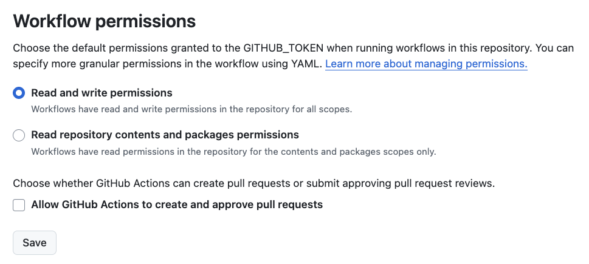
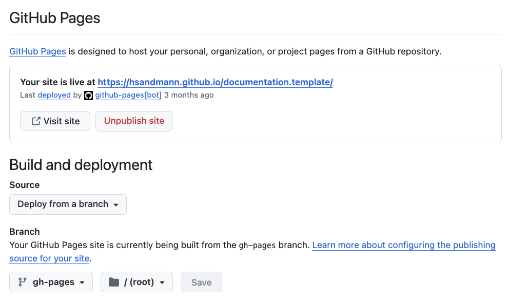

# This documentation

## Pré-requisitos

Antes de começar, certifique-se de que você possui os seguintes pré-requisitos instalados em seu sistema:

- **Git**: Para clonar o repositório.

## Instalando o Python

=== "Linux"

    Instale o Python 3.8 ou superior.

    ```shell
    sudo apt install python3 python3-venv python3-pip
    python3 --version
    ```

=== "macOS"

    Instale o Python 3.8 ou superior.

    ```shell
    brew install python
    python3 --version
    ```

=== "Windows"

    Instale o Python 3.13 ou superior. Baixe o instalador do site oficial do Python (https://www.python.org/downloads/) e execute-o. Certifique-se de marcar a opção "Add Python to PATH" durante a instalação.

    ```shell
    python --version
    ```

---

## Usage

Para utilizar o código deste repositório, siga as instruções a seguir:

Clone ou fork este repositório:

```shell
git clone <URL_DO_REPOSITORIO>
```

Crie um ambiente virtual do Python:

=== "Linux/macOS"

    ```shell
    python3 -m venv env
    ```

=== "Windows"

    ```shell
    python -m venv env
    ```

Ative o ambiente virtual (**você deve fazer isso sempre que for executar algum script deste repositório**):

=== "Linux/macOS"

    ```shell
    source ./env/bin/activate
    ```

=== "Windows"

    ```shell
    .\env\Scripts\activate
    ```

Instale as dependências com:

=== "Linux/macOS"

    ```shell
    python3 -m pip install -r requirements.txt --upgrade
    ```

=== "Windows"

    ```shell
    python -m pip install -r requirements.txt --upgrade
    ```

## Deployment

O material utiliza o [mkdocs](https://www.mkdocs.org/) para gerar a documentação. Para visualizar a documentação, execute o comando:

```shell
mkdocs serve -o
```

Para subir ao GitHub Pages, execute o comando:

```shell
mkdocs gh-deploy
```

Esse repositório possui um workflow do GitHub Actions que executa o comando `mkdocs gh-deploy` sempre que houver um push na branch `main`. Assim, não é necessário executar esse comando manualmente. Toda vez que você fizer um **push** na branch `main`, a documentação será atualizada automaticamente no GitHub Pages.

!!! warning "Aviso 1"

    Para que o github actions funcione corretamente, é necessário que o repositório esteja configurado para que o *bot* `github-actions[bot]` tenha permissão de escrita. Você pode verificar isso nas configurações do repositório, na seção "Actions" e depois em "General". Certifique-se de que a opção "Workflow permissions" esteja definida como "Read and write permissions".

    

!!! warning "Aviso 2"

    Depois de publicar, caso não consiga acessar a página, verifique se o github pages está configurado corretamente. Vá até as configurações do repositório, na seção "Pages" e verifique se a branch `gh-pages` está selecionada como fonte. Se não estiver, selecione-a e salve as alterações.

    

!!! danger "Pay Attention"

    No arquivo '`mkdocs.yml`, a seção `site_url` deve estar configurada corretamente para o seu repositório. Por exemplo, se o seu repositório estiver em `https://github.com/usuario/repositorio`, a seção `site_url` deve ser:

    ```yaml
    site_url: https://usuario.github.io/repositorio
    ```

    Também, certifique-se de que a seção `repo_url` esteja configurada corretamente para o seu repositório. Por exemplo:

    ```yaml
    repo_url: https://github.com/usuario/repositorio
    ```
